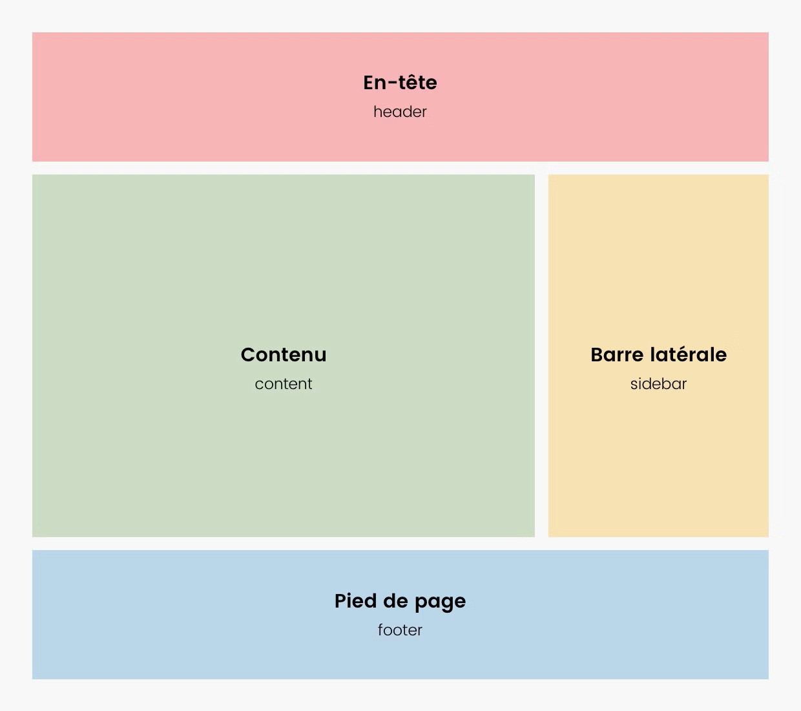

# Eval-wordpress-theme-1
Évaluation Wordpress Thème Niveau 1

Travaux Pratiques (TP) guidé de l'installation jusqu'à un thème fonctionnel.

## Préparation

Faites un FORK de ce dépôt et nommez le "eval-wordpress-20260318-XX" (remplacez XX par vos initiales).

---

## TP : Création d'un thème WordPress "From Scratch"

**Objectif :** Transformer une structure HTML statique en un thème WordPress dynamique.

### Étape 1 : Environnement et Structure

1.  **Installation :** Installez un WordPress à partir du docker-compose fourni.
    - Avant de démarrer les conteneurs, Renommez les : Remplacer *DWWM2503* par votre *identifiant ARFP* 
2.  **Dossier du thème :** Créez un dossier nommé `tp-prenom-nom` dans `wp-content/themes/`.
3.  **Fichiers vitaux :** Créez les fichiers `style.css` et `index.php`. 
    * *Consigne :* Le fichier CSS doit contenir l'en-tête de commentaire obligatoire pour que le thème soit activable dans l'administration.
4.  **Activation :** Activez votre thème depuis l'onglet "Apparence".

---

### Étape 2 : Modularité

Découpez votre structure HTML pour créer les fichiers de base :
1.  **header.php :** Doit inclure la balise `<?php wp_head(); ?>` juste avant `</head>`.
2.  **footer.php :** Doit inclure la balise `<?php wp_footer(); ?>` juste avant `</body>`.
3.  **Appel des fichiers :** Dans `index.php`, utilisez les fonctions PHP `get_header()` et `get_footer()` pour reconstituer la page.

---

### Étape 3 : La Boucle WordPress 

Dans le fichier `index.php`, entre l'en-tête et le pied de page :
1.  **Structure :** Codez "The Loop" pour vérifier s'il y a des articles.
2.  **Affichage :** Pour chaque article trouvé, affichez dans une balise `<article>` :
    * Le titre (dans une balise `<h2>`).
    * L'extrait.
    * La date de publication.
    * Le nom de l'auteur.
    * La catégorie

---

### Étape 4 : Du contenu 

1. Créez 2 catégories : `actualités` et `tutoriaux`
2. Installez l'extension Faker-Press et générez 5-10 articles par catégorie.
3. Créez une page "a-propos" et y inclure la procédure d'installation de Wordpress avec Docker ainsi qu'un lien vers le dépôt GITHUB que vous avez créez à l'étape de préparation. Le libellé du lien doit être "Regarde mon super GitHub" et doit être centré sur la page.

--- 

### Étape 5 : Fonctions et Menus 

1.  **functions.php :** Créez ce fichier à la racine de votre thème.
2.  **Enregistrement :** Déclarez un emplacement de menu nommé "Menu Principal" via la fonction `register_nav_menu`.
3.  **Administration :** Allez dans l'administration WP, créez un menu, liez-le à l'emplacement créé et ajoutez-y quelques pages dont la page "a-propos".
4.  **Affichage :** Utilisez `wp_nav_menu()` dans votre `header.php` pour faire apparaître ce menu sur le site.

---

### Étape 6 : C'est joli ou pas ? 

1. **Image à la une :** Activez le support des images à la une (`add_theme_support`) et affichez-les dans la boucle de `index.php`.
2. **CSS :** Créez les règles CSS afin que la structure de vos pages respectent la disposition suivante (le choix des couleurs vous appartient) :

3. Ajouter une sidebar à l'emplacement prévu et y inclure 1 calendrier et la liste des derniers articles.
4. L'entête doit obligatoirement contenir la bannière suivante : 

5. Le pied de page contient au moins le lien vers la page "a-propos" et le texte "Copyright (ANNEE) DWWM2503 PRENOM NOM"
--- 

### Étape 7 : Les templates 

1. Ajouter les templates nécessaires pour : 
    - Afficher une liste d'articles 
        - Les articles sont affichés dans un tableau HTML, on doit y voir : Le titre, la date de publication, l'auteur et un lien vers l'article.
    - Afficher 1 seul article
        - Dans une balise `<article>`
        - un header avec Titre H2, nom de l'auteur et date de publication/
        - Contenu complet dans un `
`
        - un footer avec : nom de la catégorie

---

### Étape 8 : Sauvegarde

1. COMMIT + PUSH vers Github.
    - Message de COMMIT = "Wordpress OK"
2. Exporter la base de données (avec l'outil de votre choix)
3. Inclure le fichier SQL dans un répertoire "SQL" de votre dépôt.
4. COMMIT + PUSH le fichier SQL
    - Message de COMMIT "Sauvegarde SQL OK"

